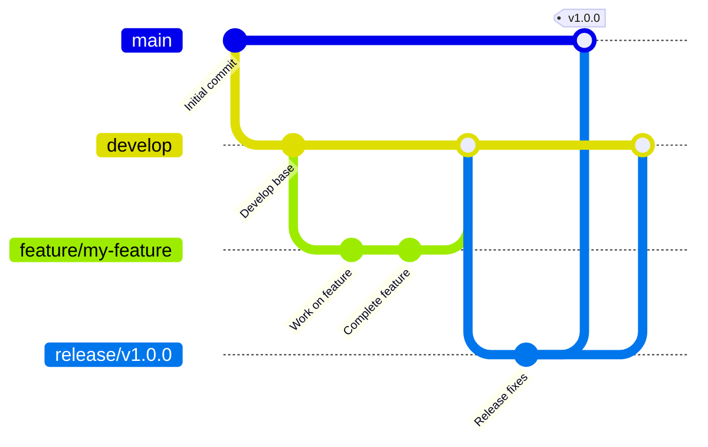

# Contributing to idea-graph

Thank you for contributing! To maintain code quality and stability, we follow the **Git Flow** branching strategy. Please adhere to these guidelines for all contributions.

---

## Branching Model

We use the standard Git Flow branching model:



### 1. Main Branches

*   **`main`**: Represents production-ready code. Commits on this branch are tagged with release versions (e.g., `v1.0.0`). Direct commits are forbidden.
*   **`develop`**: The primary branch for active development. Features are merged here once complete.

### 2. Supporting Branches

#### Feature Branches (`feature/*`)
*   **Source branch**: `develop`
*   **Target branch**: `develop`
*   **Naming convention**: `feature/<feature-name>` (e.g., `feature/node-search`)
*   **Workflow**:
    1. Check out develop and pull latest changes:
       ```bash
       git checkout develop
       git pull
       ```
    2. Start the feature branch:
       ```bash
       git checkout -b feature/my-feature
       ```
       *(Or using Git Flow CLI: `git flow feature start my-feature`)*
    3. Make commits as you work on the feature.
    4. Merge feature back into develop when completed:
       ```bash
       git checkout develop
       git merge --no-ff feature/my-feature
       git branch -d feature/my-feature
       ```
       *(Or using Git Flow CLI: `git flow feature finish my-feature`)*

#### Release Branches (`release/*`)
*   **Source branch**: `develop`
*   **Target branches**: `main` and `develop`
*   **Naming convention**: `release/v<version>` (e.g., `release/v1.0.0`)
*   **Workflow**:
    1. Start the release branch when ready for a release cycle:
       ```bash
       git checkout -b release/v1.0.0 develop
       ```
       *(Or using Git Flow CLI: `git flow release start v1.0.0`)*
    2. Fix bugs and update metadata/versioning on this branch.
    3. Finish the release by merging into both `main` and `develop`:
       ```bash
       # Merge into main and tag
       git checkout main
       git merge --no-ff release/v1.0.0
       git tag -a v1.0.0 -m "Release v1.0.0"
       
       # Merge into develop
       git checkout develop
       git merge --no-ff release/v1.0.0
       
       # Delete release branch
       git branch -d release/v1.0.0
       ```
       *(Or using Git Flow CLI: `git flow release finish v1.0.0`)*

#### Hotfix Branches (`hotfix/*`)
*   **Source branch**: `main`
*   **Target branches**: `main` and `develop`
*   **Naming convention**: `hotfix/v<version>` (e.g., `hotfix/v1.0.1`)
*   **Workflow**:
    1. Start the hotfix branch from the production release:
       ```bash
       git checkout -b hotfix/v1.0.1 main
       ```
       *(Or using Git Flow CLI: `git flow hotfix start v1.0.1`)*
    2. Apply the emergency bug fix.
    3. Finish the hotfix by merging back to both `main` and `develop`:
       ```bash
       # Merge into main and tag
       git checkout main
       git merge --no-ff hotfix/v1.0.1
       git tag -a v1.0.1 -m "Hotfix v1.0.1"
       
       # Merge into develop
       git checkout develop
       git merge --no-ff hotfix/v1.0.1
       
       # Delete hotfix branch
       git branch -d hotfix/v1.0.1
       ```
       *(Or using Git Flow CLI: `git flow hotfix finish v1.0.1`)*
